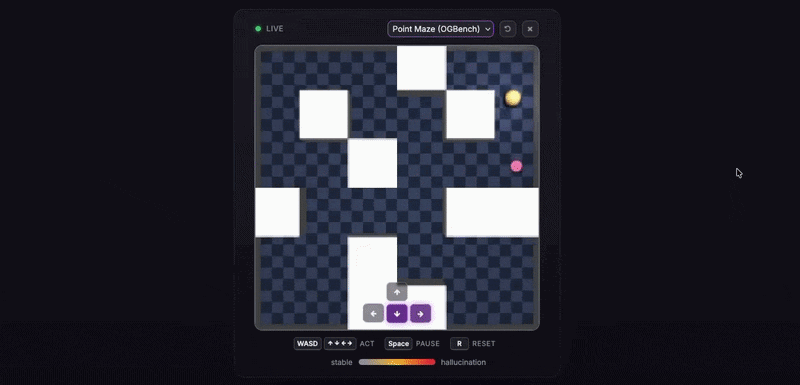
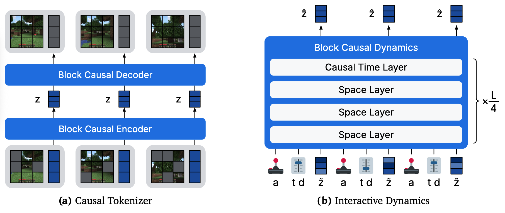
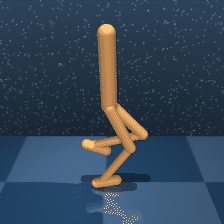
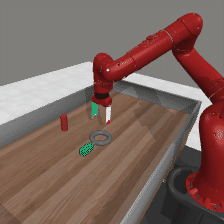
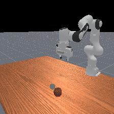
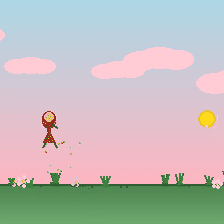
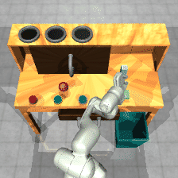
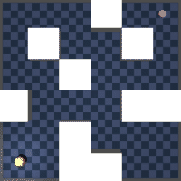
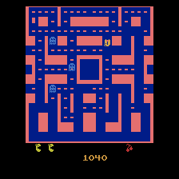

<h1>Hallucination in World Models is Predictable and Preventable</h1>

Official code release for the paper

[**Hallucination in World Models is Predictable and Preventable**](https://www.nicklashansen.com/mmbench2)

by [Nicklas Hansen](https://www.nicklashansen.com) and [Xiaolong Wang](https://xiaolonw.github.io) (UC San Diego).

This repository contains code for **training and evaluation of large generative world models**, as well as our technical contributions: hallucination predictors, targeted data collection, and a browser interface for open-ended interaction with world models. We also release checkpoints for our pretrained and finetuned 350M-parameter world models as well as the full 427-hour dataset used to train them.

🌐 **Interactive paper:** https://www.nicklashansen.com/mmbench2

🕹️ **Live demo:** https://www.nicklashansen.com/mmbench2/#live-demo

📄 **Paper:** https://arxiv.org/abs/2606.27326

📦 **Dataset:** https://huggingface.co/datasets/nicklashansen/mmbench2

🤖 **Models:** https://huggingface.co/nicklashansen/mmbench2-models

----



### Quickstart

With the conda environment set up (see [Installation](#installation)), launch the interactive web interface on a CUDA-enabled GPU. It seeds rollouts from the live simulators, so **no dataset download is required**:

```
cd src
./run_interactive.sh    # serves at http://localhost:7860
```

`run_interactive.sh [base|coverage_aware|combined]` selects the model variant (default `combined`); extra flags pass through to `interactive.py` (e.g. `./run_interactive.sh combined --port 7861`). To only fetch checkpoints, run `python download_checkpoints.py --variant combined`.

----

## Architecture



Our world model largely follows the architecture and training recipe of [Dreamer 4](https://arxiv.org/abs/2509.24527), adapted for large-scale multi-task continuous control. A causal video **tokenizer** is trained via masked auto-encoding of 224×224 RGB observations (50M-parameter encoder + 50M-parameter decoder, projecting to a 64-dim tanh-bounded latent). A 250M-parameter block-causal Transformer **dynamics model** is then trained on top of the frozen tokenizer with a shortcut flow-matching objective, conditioned on action tokens. Reward prediction and behavior cloning policy heads are added after pretraining.

----

## MMBench2 dataset

</br>

Our released dataset, **MMBench2**, spans **210 continuous control tasks** across 10 domains: DMControl, DMControl Extended, Meta-World, ManiSkill3, MuJoCo, MiniArcade, Box2D, RoboDesk, OGBench, and Continuous Atari. It consists of 65,600 mixed-quality trajectories (427 hours of 224×224 video at 15 fps; ~23M frames), ground-truth action and reward labels, language instructions, and live simulators for every task. Actions span 1–16 dimensions (zero-padded to 16 with a per-dimension validity mask). Of the 210 tasks, 200 form the pretraining corpus and 10 are held out as entirely unseen transfer tasks. The dataset is hosted on the Hugging Face Hub:

```
cd src
python download_dataset.py --local_dir ./data                 # full dataset
python download_dataset.py --local_dir ./data --subset val    # a single partition
```

----

## Installation

You will need a machine with at least one CUDA-enabled GPU for inference. For training we recommend at least 8×H100 GPUs and >512 GB RAM. We provide an `environment.yaml` for installation with [Conda](https://docs.conda.io/en/latest):

```
conda env create -f environment.yaml
conda activate mmbench2
```

The Atari domain's `ale-py` dependency is installed via the `gymnasium[atari]` extra. Continuous-action Atari additionally needs `ale_py==0.10`, which is commented out in `environment.yaml` due to a version conflict with the pinned `gymnasium` — install it separately only if you need continuous-action Atari. The dataset is downloaded via `src/download_dataset.py` and checkpoints via `src/download_checkpoints.py` (see [Checkpoints](#checkpoints)).

----

## Data preprocessing

The dataset is preprocessed into a sharded format for efficient loading during training (the full preprocessed dataset requires roughly **8 TB** of disk). Preprocess a single partition by pointing `--filedir` at the raw partition and `--outdir` at the shard output directory:

```
cd src
python preprocess_dataset.py --filedir ./data/expert --outdir ./data/expert-shards
```

Repeat for each partition you intend to train on; see `preprocess_dataset.py --help` for additional options. As a shortcut, run `bash preprocess.sh` from the repo root to preprocess every partition found under `./data`.

----

## Training

The world model is trained in two stages. The pretrained models in the paper use 8×H100 GPUs. The tokenizer is pretrained for 300k steps and the dynamics model is pretrained for 180k steps.

**Tokenizer:** set `--data_dirs` to one or more preprocessed shard directories, then:

```
cd src
torchrun --nproc_per_node=8 train_tokenizer.py
```

Checkpoints are saved under `./logs/tokenizer_ckpts/` by default.


**Dynamics model:** set `--data_dirs` (raw) and `--frame_dirs` (preprocessed), then:

```
cd src
torchrun --nproc_per_node=8 train_dynamics.py
```

This assumes a trained tokenizer. Pass `--tokenizer_ckpt` if it is not at the default `./logs/tokenizer_ckpts/latest.pt` path.

----

## Checkpoints

Pretrained tokenizer + dynamics checkpoints are released on the Hugging Face Hub and can be downloaded via `src/download_checkpoints.py`. Each variant is a `(tokenizer.pt, dynamics.pt)` pair (224×224):

| Variant | Description |
|---------|-------------|
| `base` | Pretrained world model |
| `coverage_aware` | Coverage-aware finetuned world model |
| `combined` | Finetuned with all targeted data-collection sources |

```
cd src
python download_checkpoints.py --variant combined    # or: base | coverage_aware | all
```

----

## Hallucination: detection and mitigation

This release includes the method from the paper:

- **Three runtime hallucination predictors:**: tokenizer round-trip residual (`u_r`), flow instability (`u_f`), and inter-seed denoising variance (`u_s`), each motion-normalized (`u_norm`). See `src/uncertainty.py`; the interactive interface overlays them live.
- **Coverage-aware training:** resampling to upweight under-represented regions of the state-action space (`train_tokenizer.py` / `train_dynamics.py`).
- **Targeted data collection:** the predictors act as a curiosity reward for closed-loop online data collection (`src/collect_data.py`, `src/curiosity.py`).

See the [interactive paper](https://www.nicklashansen.com/mmbench2) for full details and a live demo, or alternatively the [PDF version](https://www.nicklashansen.com/mmbench2/paper.pdf).

----

## Interactive web interface

We provide a browser interface for open-ended interaction with the world model (requires a CUDA-enabled GPU with ≥4 GB memory). The simplest entry point is `run_interactive.sh` (see [Quickstart](#quickstart)); alternatively run `interactive.py` directly:

```
cd src
python interactive.py --tokenizer_ckpt <tok.pt> --dynamics_ckpt <dyn.pt>
```

Then open `http://localhost:7860`. On a remote (headless) machine, forward the port via SSH (`ssh -L 7860:127.0.0.1:7860 user@remote-machine`) to access it on your local machine. Use `--port` to change the port.

----

## Citation

If you find this work useful, please consider citing:

```
@article{hansen2026hallucination,
  title   = {Hallucination in World Models is Predictable and Preventable},
  author  = {Nicklas Hansen and Xiaolong Wang},
  journal = {arXiv preprint arXiv:2606.27326},
  year    = {2026}
}
```

----

## Acknowledgments

Our world model architecture and training recipe is largely based on our earlier [PyTorch implementation](https://github.com/nicklashansen/dreamer4) of [Dreamer 4](https://arxiv.org/abs/2509.24527), and MMBench2 builds upon [MMBench](https://arxiv.org/abs/2511.19584). We also thank [Edward Hu](https://github.com/edwhu) for an open-source [JAX implementation](https://github.com/edwhu/dreamer4-jax) of Dreamer 4 that served as a useful reference when first developing our PyTorch implementation.

## License

This project is released under the MIT License — see the `LICENSE` file. It relies on third-party code subject to their respective licenses.
